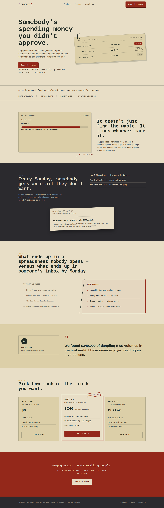

# Flagged — Marketing Landing Page (Concept Project)



A self-directed concept project: full marketing site design for an invented FinOps SaaS product, taken from brand direction through a reusable Figma component system to a coded, responsive build.

**This is a concept piece, not client work.** Flagged isn't a real product — there's no real client, no real users, and no real conversion data behind it. It exists to demonstrate design direction, component thinking, and conversion-layout reasoning end to end, not to claim a shipped result.

🔗 **Live demo:** [add your GitHub Pages link here once enabled]

## What's in this repo

- `flagged-landing-page.html` — coded, responsive landing page (HTML/CSS, single file)
- `flagged-figma-component-spec.md` — component variants, design tokens, frame/breakpoint structure, accessibility contrast checks, and the conversion-design reasoning behind the layout

## The brief (self-authored)

**Product:** Flagged — finds unowned cloud spend, identifies who's responsible for it, and emails them about it weekly.
**Audience:** Platform engineers and engineering managers at startups losing visibility into AWS/GCP spend.
**Brand personality:** Blunt. Procedural. A little smug.

The visual system is built around an audit/ledger concept — kraft paper, carbon-copy dark bands, a single ink-stamp red — rather than a default SaaS look, because the product's whole pitch is "we'll tell you the uncomfortable thing plainly." A soft, reassuring palette would undercut that.

## Responsive behavior

Built and tested at 1440 / 1024 / 768 / 375px. Each breakpoint actually restructures the layout rather than just narrowing columns — see the breakpoint table in `flagged-figma-component-spec.md` for the specifics (a rotation becomes a border, a horizontal offset becomes an indent, a scale-up becomes a reorder).

## Accessibility

All text/background color pairs are checked against WCAG AA (4.5:1 normal text, 3:1 large text) — ratios are documented in the spec file. Every interactive element has a visible focus state, and the one load animation respects `prefers-reduced-motion`.

## Viewing locally

Clone the repo and open `flagged-landing-page.html` directly in a browser — no build step, no dependencies.

```
git clone https://github.com/yourusername/your-repo-name.git
cd your-repo-name
open flagged-landing-page.html
```
